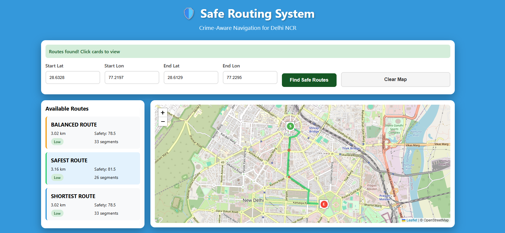
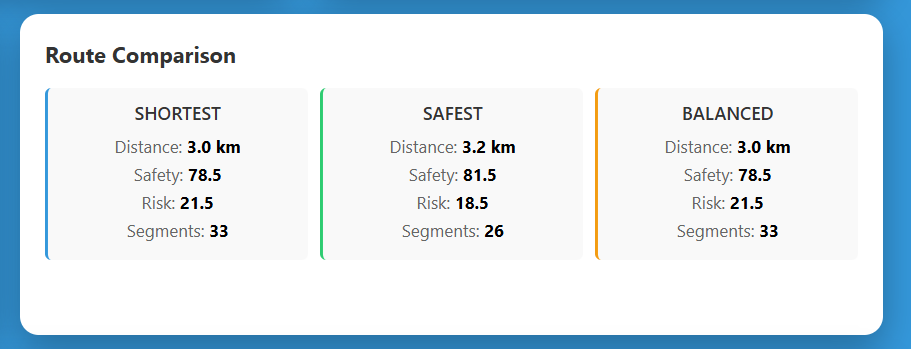

# Safe Routing System for Delhi NCR

A crime-aware navigation system that suggests safer routes by combining **machine learning**, **historical crime data**, and **OpenStreetMap road networks**.  
Unlike traditional navigation systems that optimize only for distance or time, this project allows users to consider **safety as a routing factor**.

---

## Project Overview

Urban navigation systems generally ignore crime risk while recommending routes.  
This project addresses that gap by predicting crime risk across locations in Delhi NCR and integrating it into route planning.

The system generates **three types of routes** between a source and destination:
- **Shortest Route** – Optimized only for distance
- **Safest Route** – Minimizes crime risk
- **Balanced Route** – Trade-off between distance and safety

---

## How the System Works

1. **Crime Data Processing**
   - Historical crime data from Delhi NCR is collected and preprocessed.
   - Multiple crime types are combined using severity-based weights.
   - Crime density and normalized risk scores (0–100) are calculated.

2. **Crime Risk Prediction**
   - A **Random Forest Regressor** is trained to predict crime risk scores.
   - The trained model is cached to avoid retraining on every run.

3. **Spatial Risk Estimation**
   - A **KD-Tree** is built using latitude and longitude of crime data points.
   - For any location without direct data, crime risk is estimated using **Inverse Distance Weighting (IDW)**.

4. **Road Network Construction**
   - Road network data is fetched from **OpenStreetMap** using OSMnx.
   - Intersections become nodes and roads become weighted edges.

5. **Route Optimization**
   - A modified **Dijkstra’s algorithm** is applied with different edge weights:
     - Distance-based weight
     - Crime-aware safety weight
     - Balanced weight (distance + safety)
   - Three alternative routes are generated and compared.

6. **Web Interface**
   - Users enter start and end coordinates.
   - Routes are displayed on an interactive map along with distance and safety metrics.

---

## Output

<!-- Insert screenshot of map with routes here -->


<!-- Insert screenshot of route comparison metrics here -->
  


---

## Tech Stack

**Backend**
- Python
- Flask
- scikit-learn
- OSMnx
- NetworkX
- SciPy (KD-Tree)

**Frontend**
- HTML
- Leaflet.js

---

## Project Structure
```bash
Safe-Routing-Delhi
├── .gitignore
├── .python-version
├── Procfile
├── README.md
├── requirements.txt
│
├── backend
│   ├── app.py
│   ├── config.py
│   ├── evaluate.py
│   ├── evaluation_metrics.txt
│   ├── model_evaluation_results.png
│   │
│   ├── cache
│   │   └── 16b9a1879f71843f6943a5c2dff213e79640c729.json
│   │
│   ├── data
│   │   ├── crime.csv
│   │   ├── crime0.csv
│   │   ├── preprocessed.csv
│   │   ├── proc.ipynb
│   │   │
│   │   └── processed
│   │       ├── crime_model.pkl
│   │       ├── osm_graph.pkl
│   │       └── scaler.pkl
│   │
│   ├── models
│   │   ├── crime_model.py
│   │   ├── route_optimizer.py
│   │   ├── __init__.py
│   │
│   └── utils
│       ├── data_processor.py
│       ├── __init__.py
│
├── frontend
│   └── index.html

```
---

## 🚀 How to Run Locally

Follow these simple steps to set up and run the Safe Routing application on your local machine.

### Prerequisites

* **Python 3.x**
* **Git**

### Steps
  
1️⃣ **Clone Repository**  
Open your terminal or command prompt and run the following commands to clone the project and navigate into the directory:

```bash
git clone [https://github.com/VBV-py/Safe-Routing-for-Delhi.git](https://github.com/VBV-py/Safe-Routing-for-Delhi.git)
cd Safe-Routing-for-Delhi
```

2️⃣ **Install Dependencies**
```bash
pip install -r requirements.txt
```

3️⃣ **Run the Application**
```bash
python backend/app.py
```

4️⃣ **Open Browser**
```bash
http://127.0.0.1:5000
```

---
**Foundation of Data Science Course Project**